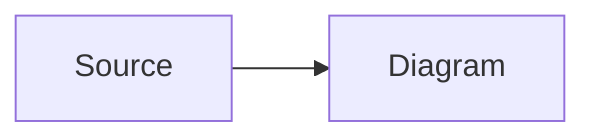

import Demo from '../../components/Demo.astro';
import Examples from '../../components/Examples.astro';
import { Code } from 'astro/components';

The Mermaid component renders [Mermaid](https://mermaid.js.org/) diagrams with two paths. By default the diagram is rendered in the browser: a loading skeleton is shown first, then the `mermaid` library is dynamically imported and replaces it with the rendered SVG. You can also pass a **pre-rendered SVG** via the `svg` prop for the server-side/static path — the diagram paints immediately and `mermaid` is never loaded on the client. Use the framework selector in the top-right to switch between implementations.

<Demo component="mermaid" example="default" />

## Examples

<Examples component="mermaid" exclude="default" />

## Guide

### Client loading

`mermaid` is an **optional peer dependency** of `@cloudvoyant/helical-react` and `@cloudvoyant/helical-svelte` — the loading skeleton renders without it, and the library chunk is fetched only when a Mermaid component mounts, so it never lands in the SSR bundle. Install it in any app that renders diagrams:

```bash
pnpm add mermaid
```

While the diagram renders, a centered spinner with an "Rendering diagram" label is shown. The placeholder carries no border or rounded corners, and the root reserves a minimum footprint (`min-h-40`), so the swap to the finished SVG never collapses the layout. The diagram's exact height cannot be reserved on the client path — the SVG's `aspect-ratio` is only known once `mermaid` has finished rendering — so a diagram taller than that minimum still nudges the layout at swap time. For exact-height, layout-shift-free reservation use the prerendered path below, where the ratio is read from the SVG `viewBox` before first paint. The raw source stays available in a `<noscript>` block for no-JS users (the spinner is hidden without JS, since it can never resolve), and is shown directly if the render fails.

### Prerendered (SSR)

For content rendered at build time — MDX pages, static exports, or server components — pass a pre-rendered SVG string through the `svg` prop:

<Code
  code={`import { Mermaid } from '@cloudvoyant/helical-react';

<Mermaid
  code="flowchart LR\\n  A --> B"
  svg="<svg viewBox=\\"0 0 480 180\\">…</svg>"
/>`}
  lang="tsx"
  themes={{ light: 'github-light', dark: 'github-dark' }}
  defaultColor={false}
/>

The `svg` string is rendered as-is via `dangerouslySetInnerHTML`/`{@html}`, so it must come from a trusted source (your own build pipeline or a sanitizing mermaid-rehype plugin). Provide an SVG that carries a `viewBox` — the component reads it and sets `aspect-ratio` on the root container, so the diagram paints at its final size with **zero layout shift**. With this path `mermaid` is never imported, so no optional peer is required at runtime.

### Using in MDX

The MDX-native way to author a diagram is a **fenced code block** with the `mermaid` language — the fence's `code.language-mermaid` is exactly the `code` source the component renders:

````mdx

````

A component map (`helical-ui-mdx`) routes `code.language-mermaid` to the `Mermaid` component so the fence renders as a diagram; the same source is usable via the JSX `code` prop directly when you prefer an explicit component:

<Code
  code={`import { Mermaid } from '@cloudvoyant/helical-react';

<Mermaid
  client:load
  code={\`
flowchart LR
  A[Source] --> B[Diagram]
\`} />`}
  lang="tsx"
  themes={{ light: 'github-light', dark: 'github-dark' }}
  defaultColor={false}
/>

The `code` prop works identically from Svelte and plain JSX; the `helical-ui-mdx` fence mapping for other MDX hosts is planned future work.

### Security

Client-rendered diagrams use mermaid's `securityLevel: 'strict'`: the generated SVG is sanitized (DOMPurify) and click bindings in the source are stripped, so untrusted diagram sources cannot execute scripts in the page. Failed renders use `suppressErrorRendering`, so an invalid diagram never injects mermaid's "Syntax error in text" graphic — the source is shown instead. The `svg` prop bypasses mermaid entirely and trusts the caller's markup, so it should only ever carry output from your own build pipeline.

### Theming

Diagram colors follow the app theme: mermaid's `themeVariables` are resolved at render time from the helical-ui shadcn CSS custom properties (`--card`, `--foreground`, `--border`, `--muted-foreground`, `--background`, …) on `<html>`, so brand-theme overrides and the active light/dark mode apply to diagrams. If those tokens are not defined, mermaid's own theme defaults are used.

You can also override colors per node in the diagram source with mermaid's `style` statement or a reusable `classDef`:

<Code
  code={`flowchart LR
  A[Green] --> B[Amber]
  style A fill:#d1fae5,stroke:#065f46,stroke-width:2px
  style B fill:#fef3c7,stroke:#92400e,stroke-width:2px`}
  lang="mermaid"
  themes={{ light: 'github-light', dark: 'github-dark' }}
  defaultColor={false}
/>

Per-node colors are part of the diagram source and win over the theme-level `themeVariables`, so they apply the same way on both rendering paths (client and prerendered).

## API Reference

### Mermaid

#### Props

| Prop                  | Type     | Default | Description                                                                                                                                                          |
| --------------------- | -------- | ------- | -------------------------------------------------------------------------------------------------------------------------------------------------------------------- |
| `code`                | `string` | —       | Mermaid diagram source. Required.                                                                                                                                    |
| `svg`                 | `string` | —       | Pre-rendered SVG markup (server/static path). When provided, renders immediately and never imports `mermaid`; should carry a `viewBox` for aspect-ratio reservation. |
| `className` / `class` | `string` | `''`    | Extra classes for the root container.                                                                                                                                |

Any other standard `div` attributes — `id`, `style`, `aria-*`, data attributes — pass through to the root container.

The root carries `data-mermaid-code` (JSON-encoded source) at all times and gains `data-mermaid-src` (raw source) once the SVG has rendered. `data-mermaid-state` reflects the current render state: `loading`, `done`, or `error` (`done` from first paint when the `svg` prop is used).

## Accessibility

The client path shows a loading skeleton with `role="status"` and an "Rendering diagram" label while mermaid loads; on failure the raw source is shown as readable text, so content is never lost to a failed render. No-JS users see the source via a `<noscript>` block. The `svg` prop renders the markup as-is — pair it with appropriate alternative text for the diagram when it carries no accessible text of its own.
